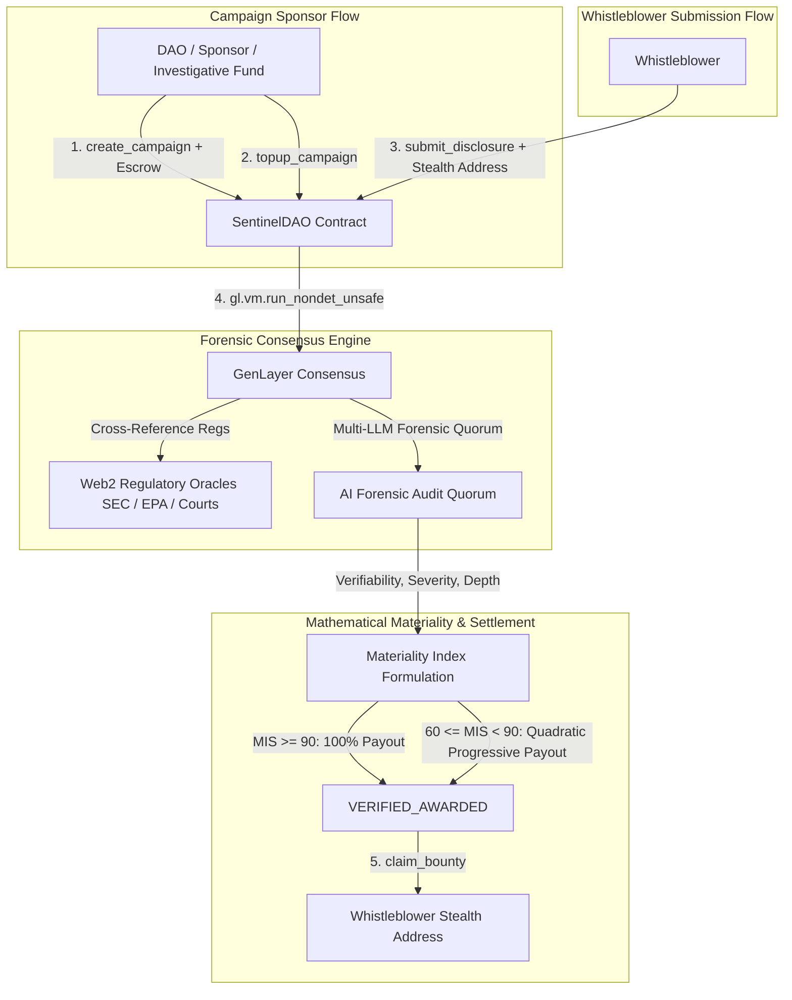

# 🛡 SentinelDAO — Whistleblower & ESG / Corporate Fraud Bounty Protocol

> **Autonomous Forensic Multi-LLM Quorum & Regulatory Oracle for Anonymous Whistleblower Bounties on GenLayer.**

SentinelDAO is an intelligent escrow and forensic adjudication protocol for corporate whistleblower bounties, ESG environmental violations, insider trading, and AI safety non-compliance. Sponsors deposit bounty escrows into decentralized campaigns, whistleblowers submit verifiable proofs via stealth addresses, and GenLayer's non-deterministic consensus cross-references public regulatory registries (SEC EDGAR, EPA enforcement, court registries) to calculate mathematical materiality and disburse bounties directly to whistleblowers.

---

## 🏛 Architecture Overview



---

## 📐 Mathematical Formulation

### Materiality Impact Score ($\text{MIS}$)
$$\text{MIS} = \frac{V \times 0.35 + S \times 0.40 + D \times 0.25}{100}$$

Where:
- $V \in [0, 100]$: **Verifiability Score** (primary source auditability, cryptographic signatures, internal ledger proofs).
- $S \in [0, 100]$: **Severity Score** (financial damages, environmental contamination toxicity, systemic impact).
- $D \in [0, 100]$: **Documentation Depth** (comprehensiveness of logs, corroborated records).

### Progressive Bounty Payout Function
$$\text{Bounty Payout} = \begin{cases}
0 & \text{MIS} < T_{\text{threshold}} \text{ or Confidence} < 80\% \\
\text{Escrow} \times \left(\frac{\text{MIS} - 60}{40}\right)^2 \times 0.90 & 60 \le \text{MIS} < 90 \\
\text{Escrow} \times 1.0 & \text{MIS} \ge 90 \text{ (Critical Material Breach)}
\end{cases}$$

---

## 🔒 Contract Storage & Methods

### Contract Specification
- **Language**: Python (`py-genlayer:1jb45aa8ynh2a9c9xn3b7qqh8sm5q93hwfp7jqmwsfhh8jpz09h6`)
- **Total Methods**: 12 (6 Write, 6 View)

### Public Write Methods
1. `create_campaign(campaign_id, target_entity, category, min_materiality_threshold, description)` [Payable]: Fund bounty campaign escrow (min 5 GEN).
2. `topup_campaign(campaign_id)` [Payable]: Increase escrow funds for an existing campaign.
3. `submit_disclosure(disclosure_id, campaign_id, evidence_hash, executive_summary, whistleblower_stealth)`: Submit whistleblower proof under a disposable stealth address.
4. `evaluate_disclosure(disclosure_id, technical_evidence, regulatory_cross_ref_url)`: Trigger AI consensus oracle to audit evidence against SEC/EPA databases.
5. `claim_bounty(disclosure_id)`: Whistleblower stealth address claims validated bounty payout.
6. `close_campaign(campaign_id)`: Sponsor closes campaign after expiration and reclaims unused escrow.

### Public View Methods
1. `get_campaign(campaign_id)`: View target entity, escrow balance, threshold, and status.
2. `get_disclosure(disclosure_id)`: View disclosure scores, evidence hash, materiality index, and status.
3. `get_records(disclosure_id)`: Access complete forensic quorum rationales and citations.
4. `list_campaigns()`: List all active bounty campaigns.
5. `list_disclosures(campaign_id)`: List disclosures for a specific campaign.
6. `get_protocol_overview()`: Protocol statistics and global counters.

---

## 🧪 Testing & Verification

```bash
# Lint and validate GenVM contract
genvm-lint check contracts/sentinel_dao.py

# Run direct-mode test suite
.venv/bin/pytest contracts/test/ -v
```

### Test Results:
```text
✓ test_initial_protocol_overview
✓ test_create_campaign_success
✓ test_create_campaign_below_min_escrow_rejection
✓ test_create_campaign_invalid_category_rejection
✓ test_create_campaign_invalid_threshold_rejection
✓ test_create_all_valid_categories
✓ test_topup_campaign_success
✓ test_submit_disclosure_success
✓ test_submit_disclosure_closed_campaign_rejection
✓ test_evaluate_disclosure_critical_breach_100_percent_payout
✓ test_evaluate_disclosure_progressive_payout_75_mis
✓ test_evaluate_disclosure_low_materiality_insufficient
✓ test_evaluate_disclosure_rejected_fraudulent
✓ test_claim_bounty_success
✓ test_claim_bounty_unauthorized_rejection
✓ test_close_campaign_success
✓ test_list_campaigns_and_disclosures
============================== 17 passed in 0.34s ==============================
```
